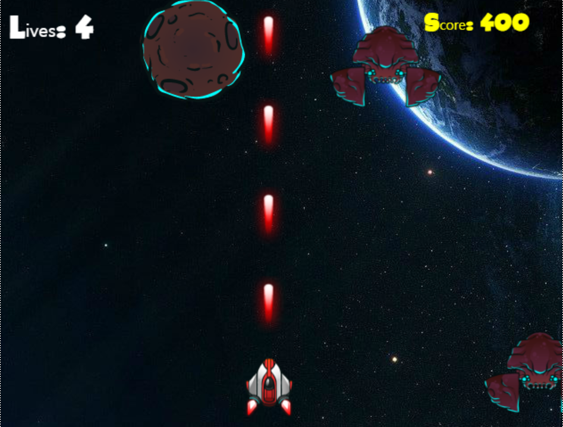
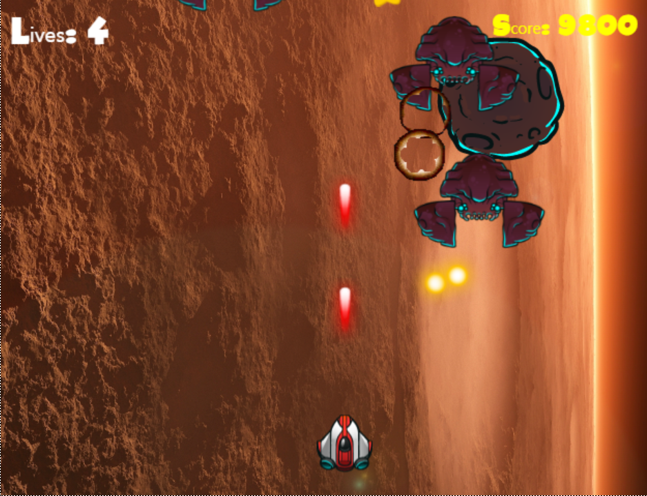
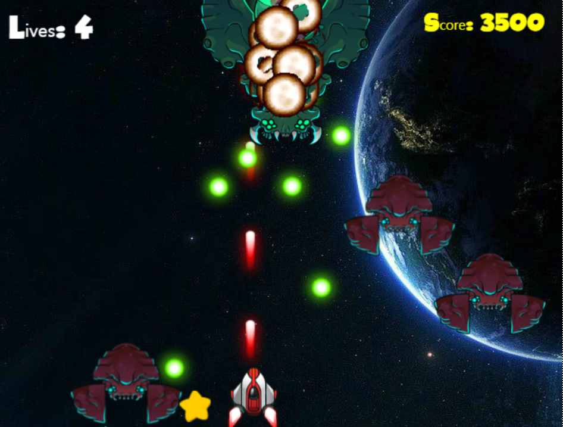

# The-Galaxy-of-the-Guardians


## Quick Start
### 1. Basic Setup
* Following list of programs are needed in order to run this demo
    * Node.js

### 2. Node.js
#### Clone this project from GitHub, and install necessary modules by running the following command in the project directory. If you already installed below modules, you don't need to follow command

* install npm, typescript

```
$ npm init
$ npm install
$ npm install typescript 
```
* install easljs
```
$ npm install @types/easeljs --save-dev

```
* install yarn package
```
npm install yarn 
yarn add easeljs --save
yarn add tweenjs --save
yarn add soundjs --save
yarn add preloadjs --save
yarn add @types/easeljs @types/tweenjs @types/soundjs @types/preloadjs --save
```
* install lite-server
```
npm install lite-server 
```

### 3. Start Game
```
lite-server
```
### 4. In Game



